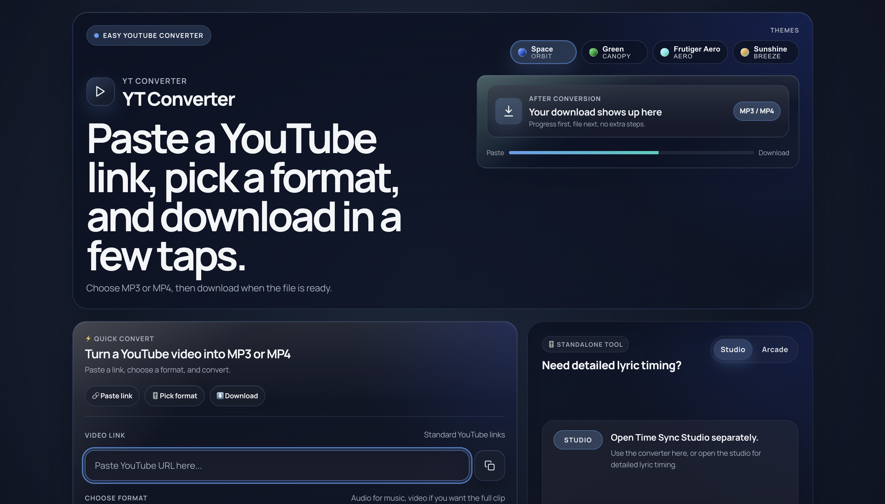
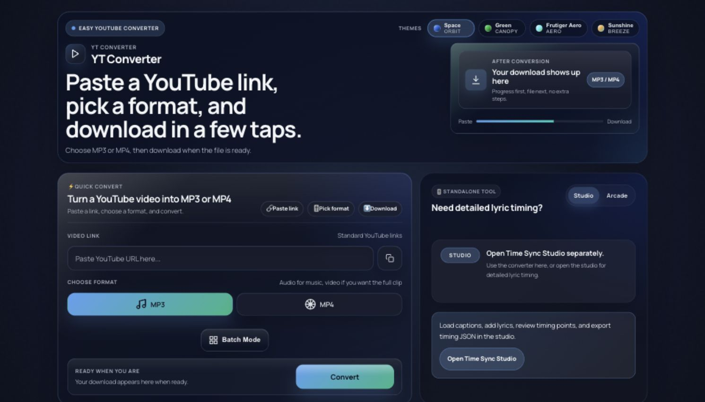
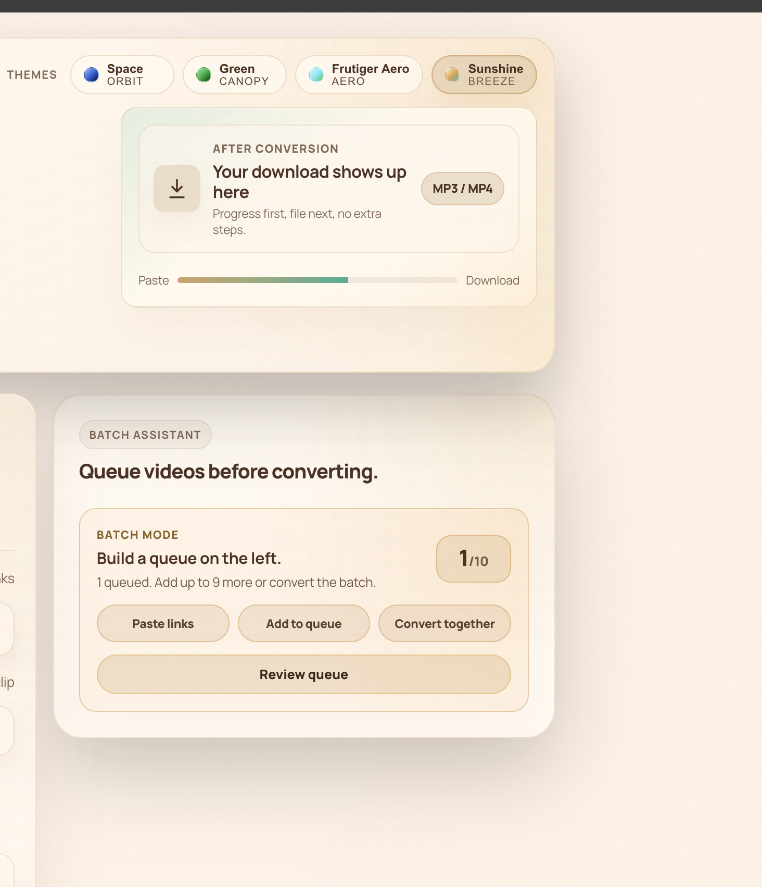
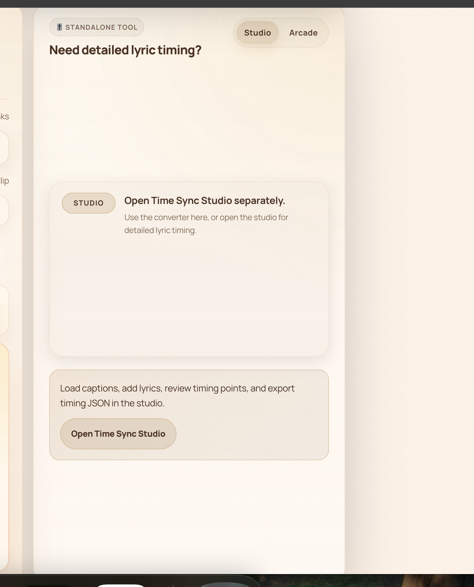
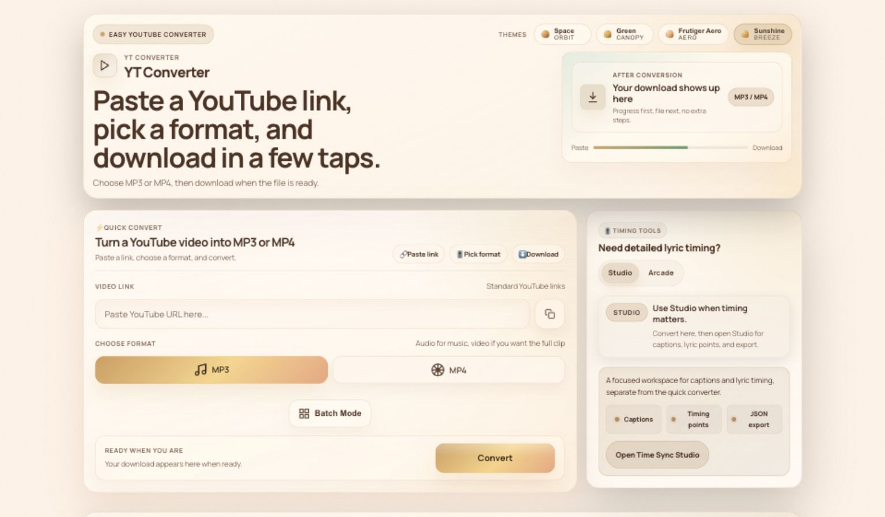
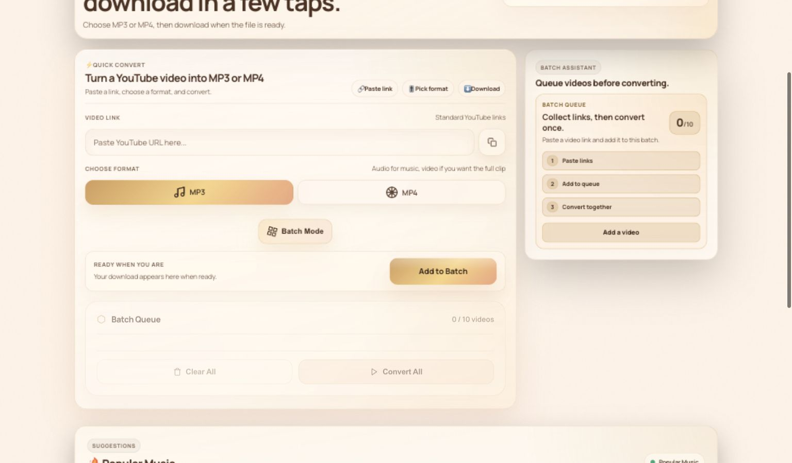
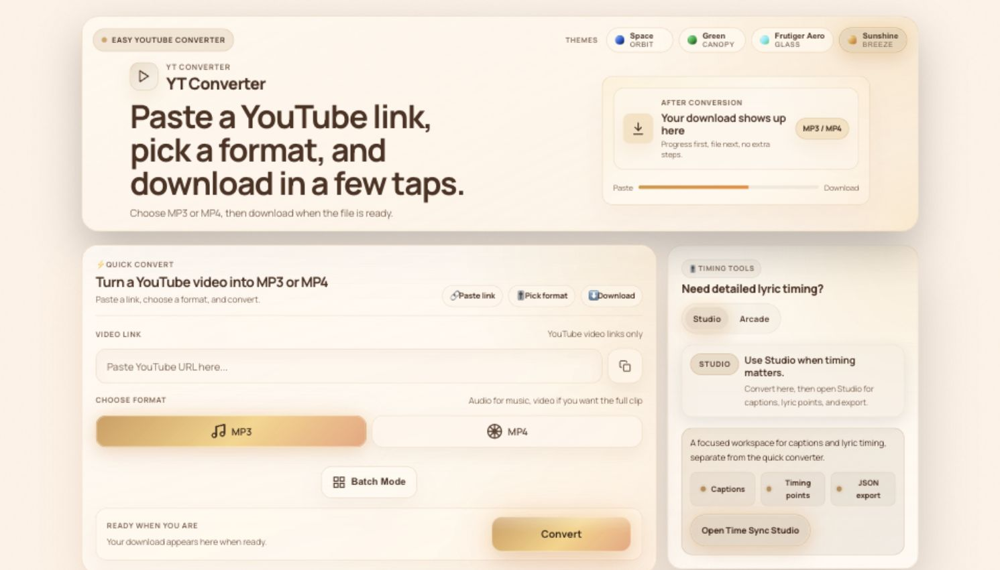

# Design Decision History

This document records product UI decisions that are easier to understand with historical context, screenshots, and measured outcomes. Use it with [CODEBASE_GUIDE.md](./CODEBASE_GUIDE.md), which remains the current design-system contract.

---

## 2026-06-07: Large-Screen Converter Hierarchy

**Status:** Accepted

**Trigger:** The large-screen home page looked too much like a hero billboard. The converter existed below it, but the first viewport spent too much attention on oversized headline copy and secondary context.

**Product principle:** Keep conversion dominant. Secondary features, including previews, themes, lyrics, and games, should make waiting better without competing with the paste, format, convert, and download flow.

### Before

The old large-screen layout made the hero feel larger than the task. The conversion teaser was useful, but it floated in a tall header while the main converter started lower on the page.

### After

The updated layout keeps the teaser, but makes it a compact conversion preview. The hero now behaves like task context, and the converter path appears much sooner.

### What Changed

- Reduced the hero title from a fluid billboard scale to a fixed product UI scale.
- Capped the preview teaser column so it stays useful without inflating the hero.
- Tightened hero spacing, logo sizing, and theme-switcher density on large screens.
- Kept the 30-second style preview idea as an enticing conversion teaser instead of removing it.
- Moved the converter step chips into a two-column desktop card header so the URL input and Convert action land higher.
- Changed the service worker so CSS and JS are network-first while online, preventing returning browsers from showing stale UI after design changes.

### Measured Outcome

Final after-state was checked in the Space theme at the same CSS viewport represented by the original Retina screenshot: `1491x851`.

| Element | After Measurement |
|---|---:|
| Hero header | `top 24`, `bottom 346`, `height 322` |
| Converter card | `top 366`, `height 492` |
| URL input | `top 521`, `bottom 573` |
| Convert button | `top 771`, `bottom 823` |
| Horizontal overflow | `false` |

The Convert button is fully visible inside the matching viewport height. A broader large-screen pass at `1536x900` also verified `space`, `green`, `frutiger-aero`, and `sunshine` without horizontal overflow.

### Files Updated

- [header.css](../css/components/header.css)
- [theme-switcher.css](../css/components/theme-switcher.css)
- [form.css](../css/components/form.css)
- [service-worker.js](../service-worker.js)
- [serviceWorker.test.ts](../tests/serviceWorker.test.ts)
- [CODEBASE_GUIDE.md](./CODEBASE_GUIDE.md)
- [RUNTIME_VERIFICATION.md](./RUNTIME_VERIFICATION.md)
- [TESTING_STATUS.md](./TESTING_STATUS.md)

### Rule Going Forward

Do not let the hero become a billboard again. On large desktop, the preview may stay enticing, but the URL input and Convert action must remain visible in the first viewport at the historical comparison size (`1491x851`) and at `1536x900`.

---

## 2026-06-07: Desktop Sidecar Proportion And Sunshine Warmth

**Status:** Accepted

**Trigger:** After the hero was tightened, the right-side sidecar still felt out of proportion on desktop. In Studio mode it stretched into a tall empty-feeling support card. In Batch mode the helper rows were too wide and the card felt heavier than its supporting role. Sunshine also showed cool blue/cyan accents in the top theme controls and related hero accents.

**Product principle:** The sidecar supports the converter. It can offer timing tools, games, or batch context, but it must not read as a second primary workflow unless the user chooses it.

### Before

Batch mode used a wide sidecar card with oversized workflow pills.

Studio mode used a large support card with too much empty space.

### After

The desktop grid now gives the converter more width and keeps the sidecar compact. Studio has clearer utility copy and a small checklist. Batch mode uses compact workflow rows and a smaller queue assistant.

### What Changed

- Changed the desktop hero-stage columns so the converter is visibly wider and the sidecar is a support column.
- Stopped the sidecar from stretching just to match the converter height.
- Renamed `Standalone tool` to `Timing tools` because the old label did not explain the sidecar's role.
- Reworked the Studio support state into compact status copy plus a checklist for captions, timing points, and JSON export.
- Reworked the Batch assistant into compact vertical workflow rows instead of wide pill controls.
- Removed cool blue/cyan leakage from Sunshine hero/theme accents by warming the Sunshine `sky`, primary button, theme preview, batch secondary, and preview-energy tokens.

### Measured Outcome

Verified at `1536x900` in Sunshine.

| Element | After Measurement |
|---|---:|
| Converter card, idle | `width 858`, `height 492` |
| Sidecar card, idle | `width 374`, `height 484` |
| Sidecar card, batch | `width 374`, `height 409` |
| Batch context card | `width 332`, `height 301` |
| Horizontal overflow | `false` |

### Rule Going Forward

Keep the sidecar compact and subordinate on desktop. Sunshine should stay warm: amber, peach, clay, and related tones. Do not introduce blue/cyan accents into Sunshine hero controls unless the UI is explicitly previewing another theme outside the active theme surface.

---

## 2026-06-07: Sunshine Button Radiance

**Status:** Accepted

**Trigger:** Sunshine needed more theme character after the cool accents were removed. The request was for buttons to feel like they radiate with a sunshine glow, without making the interface feel busy.

**Product principle:** Theme character should make the converter feel more polished, but it must not compete with the main conversion path or add motion that users cannot calm down.

### What Changed

- Added theme-scoped warm radiance shadows for Sunshine primary, selected, preview, batch, Studio, and arcade launch buttons.
- Added quieter warm hover glow for secondary Sunshine controls.
- Kept the effect to box-shadow only, so it does not change button size, layout, or touch target geometry.
- Disabled the animated pulse under `prefers-reduced-motion: reduce` while preserving the static warm glow.

### Rule Going Forward

Keep Sunshine button glow warm and restrained. Use amber, peach, clay, and orange-tinted light only. Do not add blue/cyan radiance, layout-changing rays, or always-on motion outside theme-scoped Sunshine controls.

---

## 2026-06-07: Critique Closure For `index.html`

**Status:** Accepted

**Trigger:** The original Impeccable critique for `index.html` scored the page `21/40`, with two P1 findings around first-viewport task access and secondary tools competing with conversion.

**Product principle:** A YouTube converter should let users paste, choose MP3/MP4, and convert before optional tools ask for attention. Waiting features can stay, but they should support the task instead of preceding it.

### Closure Map

| Original Finding | Closure Evidence |
|---|---|
| Primary task starts below the fold | The hero was compressed and the converter moved up. Browser check at `999x898` measured URL input `top 521`, format toggle `top 620`, and Convert `top 771`, all visible before the first viewport ends. Prior large-screen verification also checked `1491x851` and `1536x900`. |
| Secondary tools compete with conversion | Popular Music now starts below the converter/sidecar flow in the checked viewport (`top 1253`). Studio and Arcade stay inside the compact sidecar, and Batch remains an advanced affordance attached to the converter. |
| Product slop tells | The oversized hero, overlarge sidecar, repeated wide batch pills, stale cool Sunshine accents, repeated Frutiger accessible name, vague URL hint, missing thumbnail `src`, and em-dash stat placeholders were corrected. Sunshine glow remains deliberately theme-scoped because it was requested as part of the Sunshine theme character. |
| Mobile hierarchy is inverted | Mobile verification at `390x844` confirmed no horizontal overflow and kept the converter input visible before the sidecar. Mobile converter header helper copy collapses so the input appears sooner. |
| Affordances blur together | The conversion teaser is compact, noninteractive context. Real actions remain in the converter, batch assistant, Studio link, preview controls, and game launch buttons. |

### Detector Result

The bundled detector now reports only `single-font`. This is documented as a false positive for this product UI: the product register permits one UI family, and the app uses Manrope for UI plus JetBrains Mono for metadata/stat surfaces.

### Rule Going Forward

Treat the original critique as resolved unless future changes move the URL input or Convert action out of the first viewport, make waiting tools visually primary before conversion, reintroduce cool blue/cyan Sunshine accents, or add detector warnings that are not documented false positives.

---

## 2026-06-07: Sunshine Hero Preview Follow-Up

**Status:** Accepted

**Trigger:** Sunshine still read too cool in the hero conversion preview, and the right-side teaser felt pushed to the far desktop edge instead of balanced with the headline.

**After**

### What Changed

- Centered the hero's desktop column pair so the headline and teaser keep matching edge breathing room at the `1491x851` comparison size.
- Kept the teaser capped at `25rem`, so it remains useful conversion context instead of becoming a large decorative preview.
- Added Sunshine-specific teaser card, icon, badge, and meter colors using amber, peach, and clay.
- Left the theme switcher swatches destination-specific: Space remains blue, Green remains green, Frutiger Aero remains cyan/green, and Sunshine remains amber.

### Verification

Browser verification at `1491x851` measured no horizontal overflow, `72px` between the hero edge and headline start, and `72px` between the teaser end and hero edge. Computed Sunshine teaser colors were warm cream/amber for the card and orange for the meter.
